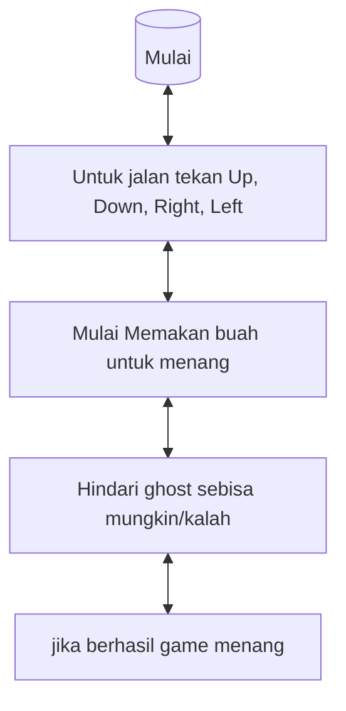

# Fadhillah

## Menjelaskan dan Menginternalisasi Computational Thinking ⭐⭐⭐⭐⭐⭐⭐
 cara berpikir how to solve problem, lalu cara menginternalisasikannya yaitu pertama dengan memahami masalahnya, lalu dikumpulkan datanya, setelah itu dicari solusinya

## Menjelaskan Jenis-Jenis Mesin Komputasi ⭐⭐⭐
- laptop = seperti komputer, namun secara portabel bisa dibawa kemana-kemana
- komputer = mesin komputasi yang terdiri dari CPU,monitor,keyboard, dan mouse
- smartwatch = perangkat komputer dalam bentuk jam tangann
- AC = system yang berfungsi untuk menaikan atau menurunkan suhu udara

## Mengktifkan dan Mencoba Google Colab [v] ⭐⭐⭐⭐⭐

## Mencoba Console Sistem Operasi

### Windows CMD [v] ⭐⭐⭐⭐
fitur cmd merupakan fitur untuk mengelola system operasi yang ada di windows, dibawah ini terkait jika menulis kalimat perintah maka akan memunculkan beragam fiturnya apa saja 

1. dir: Menampilkan daftar file dan folder dalam direktori saat ini.
2. cd: Pindah ke direktori lain.
3. mkdir: Membuat direktori baru.
4. copy: Menyalin file dari satu lokasi ke lokasi lain.
5. del: Menghapus file.
6. rmdir: Menghapus direktori.
7. ren: Mengganti nama file atau direktori.
8. type: Menampilkan isi dari file teks.
9. echo: Menampilkan teks ke layar atau menulis teks ke file.
10. cls: Membersihkan layar.
11. help: Menampilkan bantuan untuk perintah tertentu.
Referensi [1](https://www.stationx.net/windows-command-line-cheat-sheet/)

### Linux Terminal Menggunakan Google Colab [v] ⭐⭐⭐⭐

## Membuat Algoritma Dalam Bentuk Flow Chart [v] ⭐⭐⭐⭐⭐.

## Mencoba Scratch Bahasa Indonesia [v] ⭐⭐⭐⭐⭐⭐⭐
scratch yaitu sebuah program yang mana kita bisa memvisualisasikan gambaran yang kita inginkan tanpa mesti khawatir masalah syntax code

## Mencoba Algoritma Bubble Sort Menggunakan Java [v] ⭐⭐⭐
setelah mempelajari bubble short dengan java dapatlah contohnya:

public class BubbleSortAsc {
public static void main(String[] args) {
//	Variable
int[] bilangan = {5, 12, 3, 19, 1, 47};

	//	Tampilkan bilangan
	System.out.println("Bilangan sebelum di sorting Bubble Sort : "+Arrays.toString(bilangan));
	
	//	Proses Bubble Sort
	System.out.println("\nProses Bubble Sort secara Ascending:");
	for(int a = 0; a &lt; bilangan.length; a++) {
		//	Tampilkan proses Iterasi
		System.out.println("Iterasi "+(a+1));
		for(int b = 0; b &lt; bilangan.length-1; b++) { if(bilangan[b] &gt; bilangan[b+1]) {
				//	proses pertukaran bilangan
				int temp = bilangan[b];
				bilangan[b] = bilangan[b+1];
				bilangan[b+1] = temp;
			}
			
			//	Tampilkan proses pertukaran tiap iterasi
			System.out.println(Arrays.toString(bilangan));
		}
		System.out.println();
	}
	
	//	Tampilkan hasil akhir
	System.out.println("Hasil akhir setelah di sorting: "+Arrays.toString(bilangan));
}

## Mencoba dan Mendemonstrasikan Penggunakan IDE ⭐⭐

IDE yaitu perangkat lunak yang membantu kita dalam membuat suatu program, dan saya menggunakan Visual Studio Code

## Mendaftar, Mengeksplorasi, dan Mendemonstrasikan Penggunaan HackerRank [v] ⭐⭐⭐⭐⭐

saya sudah mendaftar login hackerrank account saya : @fadhillahrizqia1
dan dari hackerrank saya mencoba untuk menyelesaikan suatu problem, walaupun saya masih belum mahir terutama pemahaman saya terkait bahasa inggris yang membuat masih kesulitan dalam mendemonstrasikannya

## Mendemonstrasikan Pembuatan Aplikasi / Game Pada Platform : Mobile / Desktop / Web Browser ⭐⭐⭐⭐⭐
 untuk pembuatan game saya membuat game pacman 
 link : https://youtu.be/zpjuXEVMO8U?si=zLavw22PuY4Nl61g

## Mencoba Instalasi Database (PostgreSQL / MySQL / dsb.) [v] ⭐⭐⭐

Referensi installer [PostgreSQL](https://www.postgresql.org/download/windows/)
Referensi tambahan [1](https://db-engines.com/en/ranking)

## Mencoba Eksplorasi dan Query Database Menggunakan Database Explorer (Dbeaver / dsb.) [v] ⭐⭐⭐

Referensi installer [Dbeaver](https://dbeaver.io/download/)
Referensi [1](https://www.w3schools.com/postgresql/postgresql_create_table.php)

## Mendemonstrasikan dan Menjelaskan Penggunaan Web Browser untuk Mengakses Halaman Website HTML [v] ⭐⭐⭐⭐

yang pertama membuka browser seperti menggunakan goggle chrome atau microsoft edge
lalu mengetik laman url yang ingin kita cari, setelah itu menekan enter untuk menuju lama yang kita cari

## Mendemonstrasikan dan Menjelaskan Komponen Dari Contoh Uniform Resource Locator (URL) [v] ⭐⭐
URL adalah singkatan dari Uniform Resource Locator yang merupakan rangkaian karakter yang terdiri dari format dengan standar tertentu. URL berfungsi sebagai penunjuk alamat dari sebuah sumber daya di internet, baik berupa file teks, gambar, dokumen, dan lainnya.

komponen yang ada pada URL yaitu :
- Domain = nama dari situs atau yang menunjukkan alamat situs. Domain terdiri dari dua jenis, gratis dan berbayar. Contoh dari domain berbayar adalah .com, .net, .info. Sedangkan yang gratis contohnya adalah blogger.com
- Protokol = bagian terpenting yang memudahkan pembaca untuk membuka tautan tanpa harus menuliskan ulang pada browser. Protokol biasanya disingkat menjadi http (Hypertext Transfer Protocol).
- Direktori =  sebuah kategori dalam sebuah website yang biasanya diletakkan di akhir domain. Contoh: https://namadomain.com/ini-url-direktori
- Nama Host Komputer (WWW) = World Wide Web biasa sebutannya 

Referensi: https://www.baktikominfo.id/en/informasi/pengetahuan/berkenalan_dengan_url_bagian_penting_untuk_mengakses_internet-689

## Mencoba Pelacakan Informasi Server dari Alamat Domain [v] ⭐

Referensi terkait: [1](https://en.wikipedia.org/wiki/Country_code_top-level_domain) [2](https://en.wikipedia.org/wiki/List_of_Internet_top-level_domains)

## Mencoba Pembuatan Halaman Web Menggunakan HTML, CSS, dan JavaScript [v] ⭐⭐⭐

https://github.com/Fadhillahrizqia/Shop/tree/main/Shop (Menyusul untuk sisanya)

## Mencoba Penerapan Teknik Search Engine Optimization (SEO) Pada HTML [v] ⭐⭐⭐

penerapan teknik SEO pada HTML ada beberapa teknik yang diterapkan yaitu :
- Penggunaan Tag Tittle = untuk menuliskan judul laman yang kita inginkan
- Meta Description = untuk memberikan deskripsi singkat terkait laman yang kita buat
- Struktur Heading = seperti penggunaan h1,h2,h3,dst untuk membedakan mana judul utama dan sub judul di laman yang kita buat
- URL = untuk menulis kata kunci laman jika kita ingin mencari di SEO
- all atribut pada gambar = untuk memunculkan gambar pada laman yang kita buat
- penggunaan link =  untuk memunculkan elemen atau konten yang sekiranya serupa dengan laman orang lain pada laman kita
- penggunaan struktur markup schema = untuk memunculkan konten dimana di laman tersebut bisa dilakukan penilaian seperti ulasan pada laman kita atau menggunakan bintang juga bisa 

## Mencoba Pembuatan File JSON [v] ⭐⭐⭐

JSON singkatan dari JavaScript Object Notation yaitu format file berbasis teks yang umumnya digunakan dalam proses pertukaran data antara server dan klien. 
contoh pembuatan dari JSON :

{

    "nama" : "Fadhillah Rizqia Arfin",
    
    "alamat" : "Jln.Jatinegara",
    
    "umur" : 19,
    
    "no_Hp" : "081368830276",
    
    "email" : "frazxx2543@gmail.com",
    
    "hobi" : ["main game","jogging"]
    
	
    
}

## Mencoba Penggunaan Web Hosting Dengan Untuk Halaman HTML [v] ⭐⭐⭐

## Mencoba Penggunaan Web Hosting Dengan Untuk Web Service [v] ⭐⭐⭐

## Mencoba HTTP Request dan Web API dengan Hoppscotch / Postman [v] ⭐⭐

## Mendemonstrasikan Penggunaan Developer Tools Pada Web Browser (Firefox / Chrome) [v] ⭐⭐⭐⭐⭐

Developer Tools pada web browser memiliki berbagai kegunaan yang sangat membantu dalam pengembangan web yaitu:

1.Debugging: proses mengidentifikasi dan menghapus bug atau error di dalam kode

2.Inspeksi Elemen: kita dapat memeriksa dan mengedit langsung kode HTML dan CSS.

3.Monitoring Jaringan: jadi Developer Tools bisa saja memungkinkan kita untuk memantau jaringan yang terjadi ketika user melakukan request dan server memberikan response.

4.Console: jadi kita dapat melihat proses yang terjadi dengan kode Javascript.

5.Profiling: kita dapat melihat performa Javascript terhadap CPU.

jadi saya memilih https://uinsgd.ac.id/ untuk mencari kegunaan Developer Tools Pada Web Browser dan ini hasilnya

## Mengeksplorasi dan Menjelaskan Layanan Cloud Service yang Diminati (GCP / AWS / Azure) [v] ⭐⭐
layanan cloud service bisa bermanfaat bagi kita seperti penggunaan untuk menyimpan data seperti contohnya startup ternama seperti GO-JEK menggunakan goggle cloud untuk mempercayakannya dalam segi keamanannya 

[Google Cloud Platform](https://cloud.google.com) 

## Mencoba Penggunaan Content Management System (Wordpress) [v] ⭐⭐⭐

kegunaan wordpress itu sendiri kita bisa menggunakannya untuk membuat blog seperti artikel, laman, bahkan seperti e-commerce pun bisa dibuat menggunakan wordpress tanpa penulisan syntax code seperti HTML,JAVASCRIPT,DSB 

## Mendemonstrasikan Akses Konten Multimedia (Image, Audio, Video) ⭐⭐⭐

## Mencoba Edit Konten Multimedia (Image, Audio, Video) [v] ⭐⭐

## Mencoba Pembuatan Game dan Simulasi Menggunakan Logo [v] ⭐⭐

## Mencoba Pemrosesan Konten Multimedia (Image, Audio) Menggunakan Google Colab [v] ⭐⭐⭐

## Mencoba Web Tool AI Discriminative (Image Classification) [v] ⭐⭐⭐⭐

saya mencoba web Tool AI Discriminative (image classification) di goggle collab yang dimana saya memasukkan gambar ke dalam kolom yang sesuai di perintahkan dan begini hasilnya.

## Mencoba Web Tool AI Generative (Text to Image, Text to Text) [v] ⭐⭐⭐⭐

saya di sini mencoba Web Tool AI Generative (Text to Image) menggunakan bing ai image dan inilah hasilnya

## Mencoba Model Machine Learning Menggunakan Google Colab, TTS, Speechrecognition, dan HuggingFace [v] ⭐⭐⭐

saya di sini Mencoba Model Machine Learning Menggunakan Google Colab dan ini hasilnya

## Mencoba Data Visualization Dengan Tools [v] ⭐⭐

## Mencoba Data Visualization Dengan Code [v] ⭐⭐

Data visualization adalah teknik untuk menggambarkan informasi dan data secara grafis. Ini membantu memahami pola, tren, dan hubungan dalam data dengan lebih baik.dan ini contoh punya saya yang dimana saya menggunakan google colleb.

## Mendaftar dan Mencoba Eksplorasi HuggingFace [v] ⭐⭐⭐

penggunaan huggingface biasanya kita menggunakan untuk membuat teknologi NLP dan kita juga bisa menggunakan penelitan atau pengembangan produk juga
account = FADHILLAH

## Mendaftar dan Mencoba Eksplorasi Kaggle [v] ⭐⭐⭐⭐

1.Data: Kaggle menyediakan berbagai kumpulan data yang dapat digunakan oleh ilmuwan data.

2.Kode: Kaggle memiliki banyak contoh kode yang dibagikan oleh pengguna lain.

3.Komunitas: di kaggle juga menyediakan forum untuk diskusi untuk membahas penelitian / karya dan segala yang terkait mengenai machine learning 

4.Inspirasi: dari kaggle juga kita dapat melihat referensi dari penelitian / karya orang lain juga 

5.Kompetisi: di kaggle juga terkadang ada informasi kompetisi - kompetisi

6.Kursus: Kaggle juga menyediakan kursus-kursus yang membantu pemula memahami dasar-dasar ilmu data dan pembelajaran mesin.

dan bahkan di kaggle juga memungkinkan bagi kita untuk mencari pekerjaan dan menaikkan karir kita melalui beragam kompetisi - kompetisi agar kita bisa menarik minat perusahaan 
account = Fadhillah Rizqia Arfin

## Mencoba Protokol Komunikasi IoT (MQTT) [v] ⭐⭐

 MQTT, singkatan dari Message Queuing Telemetry Transport, biasanya protokol itu digunakan untuk projek IOT jadi di MQTT itu komponennya tidak ada server tapi broker,publisher, dan subscriber

## Mencoba Memproses File CSV Menggunakan Google Colab [v] ⭐⭐

## Mencoba Memproses File Big Data ORC Menggunakan Google Colab [v] ⭐⭐

## Menjelaskan Jurnal, Conference, Artikel, Grade Jurnal [v] ⭐⭐⭐⭐⭐

jurnal = catatan yang dibuat secara teratur dan sistematis tentang kegiatan, peristiwa, atau pemikiran yang terjadi

conference = yaitu semacam rapat / pertemuan untuk berunding atau bisa juga menyampaikan informasi ke khalayak umum di depan juga seperti artis/pejabat yang melakukan press conference

artikel = sebuah karya tulis yang disimpan di laman web biasanya seperti majalah atau di berita online 

grade jurnal = yaitu pembagian  kelas jurnal yang didasarkan pada tingkatan yang telah ditentukan dengan Q1 - Q6

## Eksplorasi Artikel Jurnal / Conference di Repository Terekognisi Internasional (IEEE / Arxiv / Science Direct / ACM /DBLP) [v] ⭐⭐⭐⭐

 kali ini saya mengksplorasi jurnal di dalam aplikasi IEEE Xplore yang dimana aplikasi IEEE Xplore adalah IEEE Xplore adalah platform digital utama untuk penemuan dan akses ke konten ilmiah dan teknis yang diterbitkan oleh IEEE (Institute of Electrical and Electronics Engineers) dan mitra penerbitannya1. IEEE Xplore berisi lebih dari 6 juta dokumen dan materi lainnya dari beberapa publikasi paling banyak dikutip di bidang teknik elektro, ilmu komputer, dan ilmu terkait. dan saya sudah dapat contoh jurnal di aplikasi tersebut yaitu https://ieeexplore.ieee.org/document/10261199

## Menonton Video Presentasi Tugas Akhir Informatika ⭐⭐⭐⭐⭐

## Mengeksplorasi Seluruh Profesi Terkait Informatika dan Profesi yang Diminati ⭐⭐⭐⭐

Software Engineer: biasanya seorang software engineer dipercayai untuk mengembangkan,menguji kelayakan software yang ada didalam suatu perusahaan 

IT Consultant: biasanya seorang IT Consultant dipercayai untuk menganalisis dan memecahkan suatu masalah yang ada pada sistem baik itu perangkat lunak, maupun keras

Web Developer: yaitu jenis pekerjaan yang biasanya merancang/membuat suatu web seperti e-commerce dsb bahkan bisa juga mengembangkan suatu web yang sudah ada

Data Analyst: Seorang data analyst menganalisis data untuk menghasilkan wawasan bisnis. Mereka mengolah data dan membuat laporan yang membantu pengambilan keputusan.

Full Stack Developer: Full stack developer memiliki pengetahuan tentang pengembangan baik di sisi depan (front-end) maupun di sisi belakang (back-end) aplikasi web.

Analyst Keamanan Siber (Cyber Security Analyst): Profesi ini fokus pada keamanan sistem dan melindungi data dari ancaman siber3.

Pengembang Augmented Reality (AR) dan Virtual Reality (VR): Pengembang AR dan VR menciptakan pengalaman interaktif dengan menggabungkan dunia nyata dan dunia digital.

## Eksplorasi Tools Untuk Belajar Bahasa Inggris (Duolingo) ⭐⭐⭐
aplikasi duolinngo cukup terkenal akan course nya dalam pembelajaran bahasa terutama bahasa inggris dengan dikemas secara menarik yang setiap tingkatannya kebanyakan mengulang kalimat/kata agar kita bisa dengan mudah terbiasa baik dalam mendengar maupun menjawab

## Eksplorasi Tools Untuk Belajar Berbicara Bahasa Inggris (HelloTalk) ⭐⭐⭐ 

mirip seperti aplikasi duolingo yang berguna untuk belajar dalam bahasa, namun aplikasi ini memungkinkan kita untuk belajar berintaraksi secara sosial agar kita dengan mudah terbiasa berkomunikasi dengan bahasa inggris

## Eksplorasi Lowongan Pekerjaan IT ⭐⭐⭐

## Eksplorasi Lowongan Freelancer IT (Upwork / Toptal / Freelancer.com) ⭐⭐⭐

jenis pekerjaan/freelance yang ada di sini cukup beragam baik itu full time sampai paruh waktu pun ada dan bisa secara bebas dimana saja untuk pengerjaannya seperti :

1.Pengembangan Perangkat Lunak:

Pengembangan aplikasi web dan mobile.
Pengembangan perangkat lunak khusus atau solusi perangkat lunak tertentu.
Pemeliharaan perangkat lunak.

2.Desain Grafis dan UI/UX:

Desain antarmuka pengguna (UI) dan pengalaman pengguna (UX).
Desain logo, brosur, dan materi pemasaran.
Desain grafis untuk aplikasi dan situs web.

3.Pengembangan Situs Web:

Pembuatan dan pengembangan situs web responsif.
Desain dan pengembangan situs e-commerce.
Pemeliharaan dan pembaruan situs web.

4.Pengelolaan Basis Data:

Desain dan pengelolaan basis data.
Optimasi kinerja dan keamanan basis data.
Pemulihan dan pembaruan basis data.

5.Jaringan dan Keamanan:

Konfigurasi dan pemeliharaan jaringan.
Audit keamanan dan implementasi langkah-langkah keamanan.
Penanganan insiden keamanan.

6.Pengujian Perangkat Lunak:

Pengujian fungsional dan pengujian keamanan perangkat lunak.
Penulisan dan eksekusi skenario pengujian.
Penyusunan laporan pengujian.

7.Administrasi Sistem:

Administrasi sistem operasi (Windows, Linux, dll.).
Pemantauan dan pemeliharaan server.
Penanganan masalah dan pemecahan masalah.

8.Pengembangan Game:

Desain dan pengembangan game.
Pemrograman game dan pengoptimalan kinerja.
Integrasi grafis dan suara dalam game.

9.Penulisan Kode dan Skrip:

Penulisan kode dan skrip khusus.
Automatisasi tugas dan alur kerja.
Pemrograman skrip untuk keperluan tertentu.

10.Konsultasi IT:

Memberikan saran tentang solusi teknologi informasi.
Analisis kebutuhan bisnis dan memberikan rekomendasi teknologi.
Konsultasi keamanan dan strategi TI.

## Eksplorasi dan Pilih Topik yang Diminati di Roadmap.sh ⭐⭐⭐

aplikasi roadmap biasanya memudahkan bagi kita yang ingin belajar IT dengan beragam macam profesi yang disesuaikan sesuai minat kita dan kita bisa mendapatkan jalan/ langkah apa saja agar kita bisa menjadi seorang expert di bidang yang kita inginkan 

 Pengembangan Web Front-end:

HTML, CSS, dan JavaScript dasar
Frameworks front-end seperti React, Angular, atau Vue.js
Pengujian dan otomatisasi pengujian
Pengelolaan state
Navigasi dan routing
Pengembangan Web Back-end:

Bahasa pemrograman seperti Node.js, Python, atau Ruby
Frameworks back-end seperti Express, Flask, atau Ruby on Rails
Basis data dan ORM (Object-Relational Mapping)
Keamanan aplikasi web
API dan integrasi layanan
Pengembangan Mobile:

Pengembangan aplikasi mobile native atau cross-platform
Frameworks seperti React Native, Flutter, atau Xamarin
Manajemen state di aplikasi mobile
Pengujian dan debugging di perangkat mobile
Ilmu Data dan Analisis:

Bahasa pemrograman seperti Python atau R
Pengolahan data dengan pandas, NumPy, atau TensorFlow
Visualisasi data dengan matplotlib, Seaborn, atau D3.js
Pembelajaran mesin dan kecerdasan buatan
Pengembangan Perangkat Lunak Umum:

Pengelolaan kode sumber dengan Git
Metodologi pengembangan perangkat lunak (seperti Agile atau Scrum)
Pengujian perangkat lunak (unit testing, integrasi, dan pengujian fungsional)
Konsep dasar pengembangan perangkat lunak
Sistem dan Jaringan:

Administrasi sistem operasi (Linux atau Windows)
Jaringan komputer dan protokol
Keamanan jaringan
Manajemen server dan cloud computing
Keamanan Informasi:

Keamanan aplikasi web
Keamanan jaringan
Pengujian keamanan (ethical hacking)
Kriptografi dan keamanan data
Pengembangan Game:

Pengembangan game dengan Unity atau Unreal Engine
Grafika dan animasi dalam game
Fisika game
Kecerdasan buatan dalam game

sebenarnya peminatan dalam situs tersebut semua tergantun pada minat kita masing masing saja

## Eksplorasi Top Github Project yang Diminati ⭐⭐

## Membangun Profil Linkedin dan Mengikuti Akun-Akun Inspirasif Bertema Informatika ⭐⭐⭐

## Membangun Profil Github Page ⭐⭐⭐⭐⭐

untuk saat ini saya membangun profil saya seperti foto, akun media sosial, serta background saya saat ini

## Mengikuti Workshop / Event / Course Terkait IT ⭐⭐⭐⭐

## Membaca dan Mengambil Inspirasi Dari Buku Bertema Informatika ⭐⭐⭐⭐⭐

